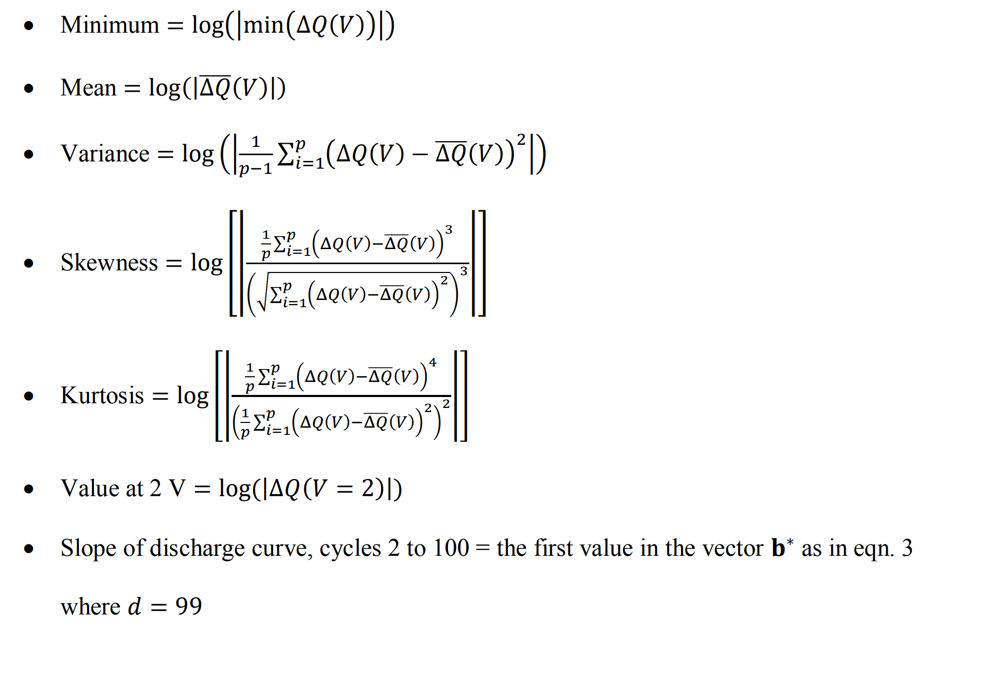
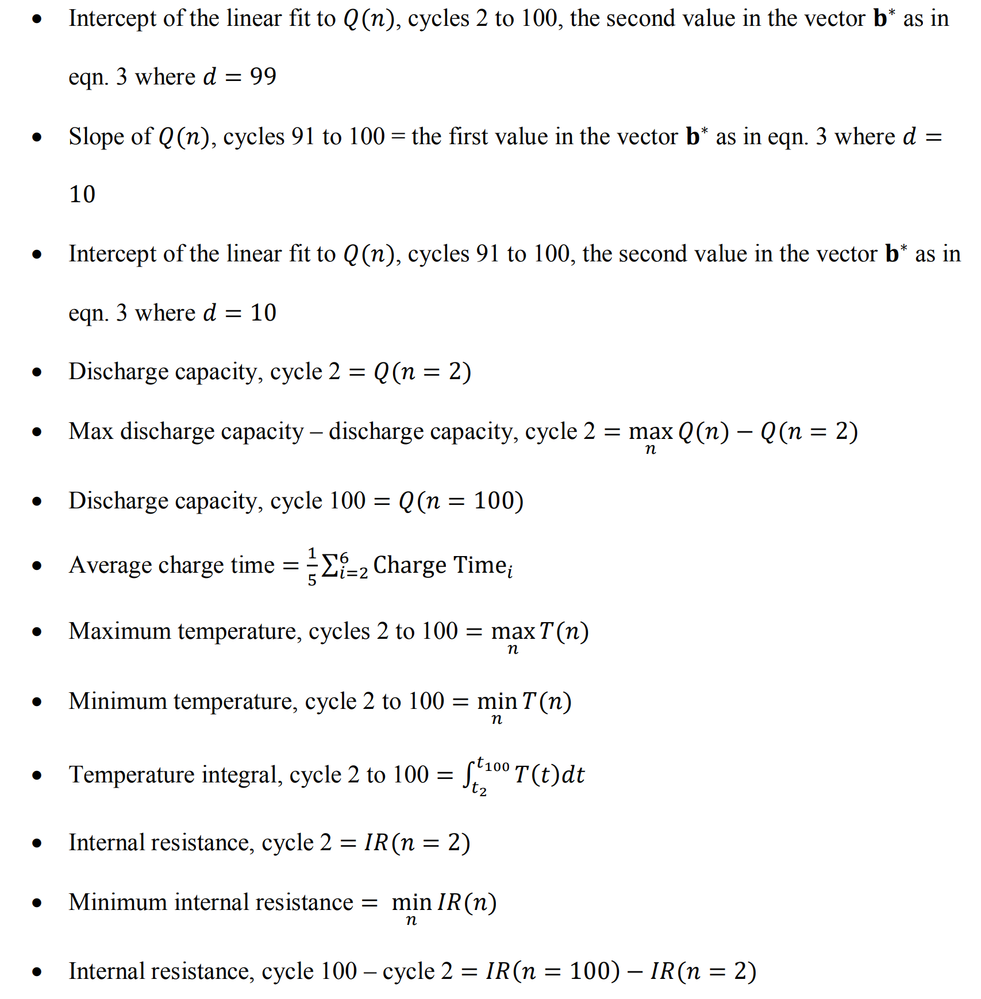

# ml_lib
ml_lib: Machine Learning ECS Hackweek Dallas Project for 
Lithium-Ion Battery Capacity Predictions
https://energy.stanford.edu/sites/g/files/sbiybj9971/f/346501527888d799d94279cfe74049fde53ca2d5a1275d083d28f925253cf657.pdf
Objectives of the project are as follows:

To find out how many cycles of data are needed to predict the end of battery cycle life

The following are the list of things that we are supposed to do:

1. Converting the .mat files to .csv files
2. Visualization of the converted data to check for consistencies
3. Create Functions/Feature definitions(Including the cycle number as variable)
4. Do multivariate linear regression on the processed data

Enclosed in this GitHub Repo is an environment.yml file with the 
dependencies required for this package. To install, open up a 
terminal, change directories to the repo, and then enter

`conda env create -f environment.yml`

Then you can enter

`source activate cycle-life`

The list of features are taken from *insert citation here for 
Severson et al., Nature (2019)

